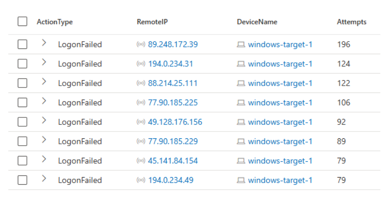
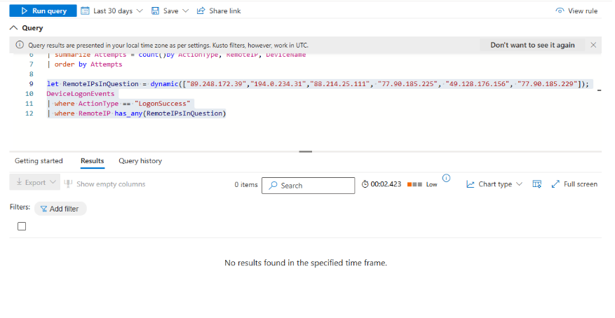
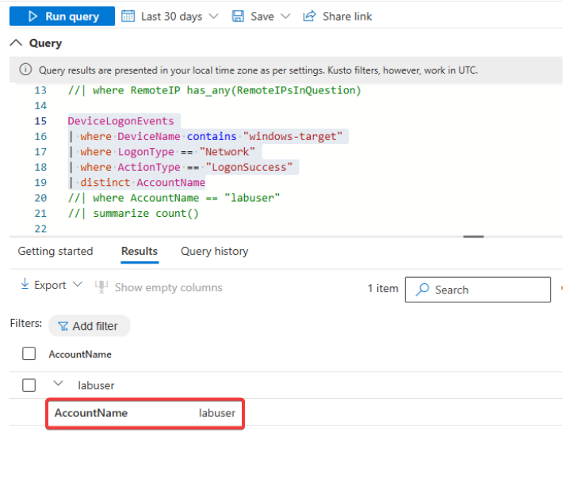
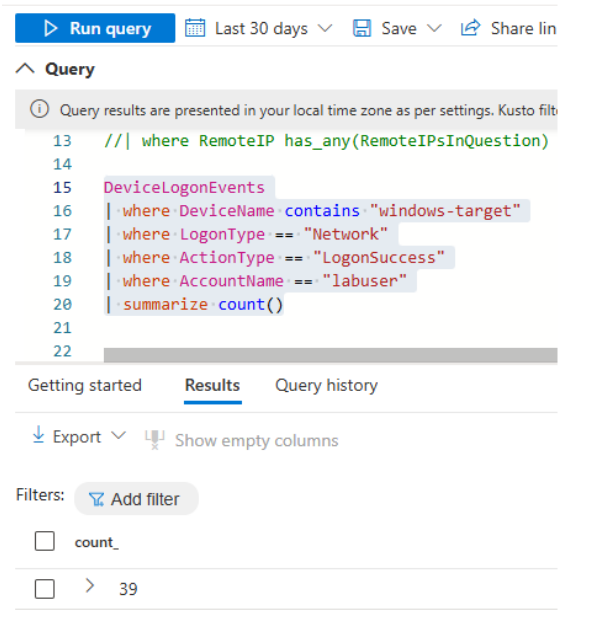
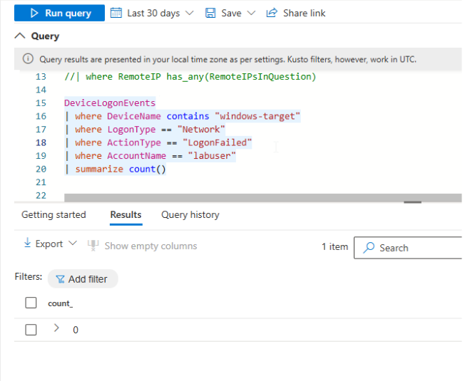

# **Investigation Report: Misconfigured Internet-Facing VM & Brute-Force Attempts**

---

## 📌 **Scenario**
During routine maintenance, the security team was tasked with investigating **VMs in the shared services cluster** (handling DNS, Domain Services, DHCP, etc.) that may have been **mistakenly exposed to the public internet**.  
The goal was to **identify any misconfigured VMs** and check for **potential brute-force login attempts/successes from external sources**.

---

## **Description**
- Some **older devices do not have account lockout policies configured**, increasing the risk of **brute-force login success**.
- **Windows-Target-1** was **exposed to the internet** for an extended period.
- Investigation was conducted to determine whether **unauthorized access** occurred.

---

## **Timeline & Findings**  

### **Identifying Exposed VM**
I queried **Azure Defender** to check if any VMs were **publicly accessible**.

#### 📜 **Query**
```kusto
DeviceInfo
| where IsInternetFacing == true
| where DeviceName contains "target"
| order by Timestamp asc
```



#### Findings:

Windows-Target-1 has been internet-facing since 1/11/2025.
### Detecting Brute-Force Login Attempts
I checked for failed login attempts from external IP addresses.

📜 Query
```kusto
DeviceLogonEvents
| where DeviceName contains "windows-target"
| where ActionType == "LogonFailed"
| where isnotempty(RemoteIP)
| summarize Attempts = count() by ActionType, RemoteIP, DeviceName
| order by Attempts desc
```


#### Findings:

Brute-force attempts were made from multiple external IPs.
### Checking for Successful Logins from Malicious IPs
I searched for any successful logins from the top 5 IP addresses that attempted brute-force attacks.

📜 Query
```kusto
let RemoteIPsInQuestion = dynamic(["89.248.172.39", "194.0.234.31", "88.214.25.111", "77.90.185.225", "49.128.176.156", "77.90.185.229"]);
DeviceLogonEvents
| where ActionType == "LogonSuccess"
| where RemoteIP has_any(RemoteIPsInQuestion)
```


#### Findings:

None of these IP addresses successfully logged in.
### Checking Account Activity
I analyzed user accounts logging into the device over the past 30 days.

📜 Query
```kusto
DeviceLogonEvents
| where DeviceName contains "windows-target"
| where LogonType == "Network"
| where ActionType == "LogonSuccess"
| distinct AccountName
```

#### Findings:

The only successful logins were from “labuser”.
### Analyzing “labuser” Account Activity
I checked how often the "labuser" account was successfully logging in.

📜 Query
```kusto
DeviceLogonEvents
| where DeviceName contains "windows-target"
| where LogonType == "Network"
| where ActionType == "LogonSuccess"
| where AccountName == "labuser"
| summarize count()
```

#### Findings:

labuser successfully logged in 39 times over the past month, with 0 failed attempts.
### Verifying Login Sources
I reviewed all successful login IP addresses for the "labuser" account.

📜 Query
```kusto
DeviceLogonEvents
| where DeviceName contains "windows-target"
| where LogonType == "Network"
| where ActionType == "LogonSuccess"
| where AccountName == "labuser"
| summarize LoginCount = count() by DeviceName, ActionType, AccountName, RemoteIP
| order by LoginCount
```






#### Findings:

No suspicious IP addresses detected.

### Conclusion:

While Windows-Target-1 was exposed, and brute-force attempts were made, there is no evidence of unauthorized logins.

## MITRE ATT&CK TTP Assessment
**Tactic	Technique (ID)	Description**

**Initial Access	T1110 -** Brute Force	Multiple failed login attempts observed targeting Windows-Target-1.

**Credential Access	T1110.003 -** Password Spraying	If failed logins originated from multiple sources with limited variations of usernames, this could indicate password spraying.

**Persistence	T1078 -** Valid Accounts	The labuser account was the only one logging in successfully, but no anomalies detected.

**Discovery	T1018 -** Remote System Discovery	If attackers performed reconnaissance, they might have probed for open services or responses from misconfigured systems.

**Defense Evasion	T1070 -** Indicator Removal (Possible)	If attackers had successfully logged in, they could have cleared logs to hide their tracks. However, no evidence of unauthorized access was found.


## Response Plan: Mitigation & Prevention
### Immediate Actions
- Remove public exposure of Windows-Target-1 from the internet.

- Ensure firewall rules block direct external access unless explicitly needed.

- Restrict RDP/SSH access to only allow connections through a secure jump host or VPN.

### Eradication Steps

- Enforce an account lockout policy for excessive failed login attempts.

- Enable Multi-Factor Authentication (MFA) for all privileged and remote access accounts.

- Review user accounts & access logs to confirm no unauthorized modifications.

### Recovery & Hardening
Conduct integrity checks on Windows-Target-1 to confirm no unauthorized system changes.

Update & harden security configurations, including OS patches & endpoint protection.

Set up monitoring alerts for residual malicious activity.


### Continuous Monitoring & Detection

- Azure Sentinel Alerts for:

- Unusual login attempts from external IPs.

- Anomalous authentication patterns (e.g., logins from new locations).

- Repeated failed login attempts exceeding thresholds.

- Deploy Microsoft Defender for Identity to track suspicious credential-based activity.

- Conduct periodic security assessments to validate access configurations.

## Lessons Learned
- Misconfigured Internet-Facing VMs Introduce Risks

- Windows-Target-1 was exposed, leading to brute-force attempts.

- Strict access controls are essential for external-facing assets.

- Lack of Account Lockout Policy Increases Risk

- Some older systems lacked account lockout policies, making them vulnerable.

- A strict lockout threshold should be enforced.

 - Continuous Monitoring is Critical

- No compromise was detected, but proactive monitoring remains crucial.

- Log analysis & automated threat detection (via Sentinel KQL queries) are key.

 - Need for Network Segmentation

- Critical services like DNS, DHCP, and Domain Services should never be internet-facing.

- Implement strict network segmentation to prevent unintended exposure.

 - Enhancing Incident Response Processes

- Investigation was only possible due to log retention & authentication visibility.

- Improving logging & alerting mechanisms is essential for faster responses.

### Detection Rule: Create Azure Sentinel Analytics Rule
To detect brute-force attempts, create an Analytics Rule in Azure Sentinel.

📜 KQL Query for Detection
```kusto
DeviceLogonEvents
| where ActionType == "LogonFailed"
| where isnotempty(RemoteIP)
| summarize FailedAttempts = count() by RemoteIP, DeviceName
| where FailedAttempts > 10  // Adjust threshold as needed
| order by FailedAttempts desc
```
